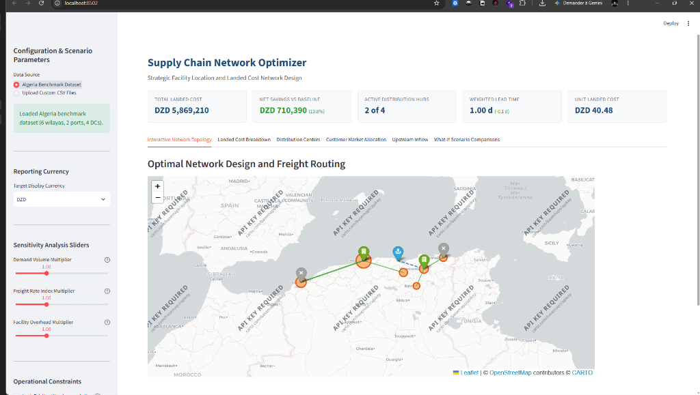
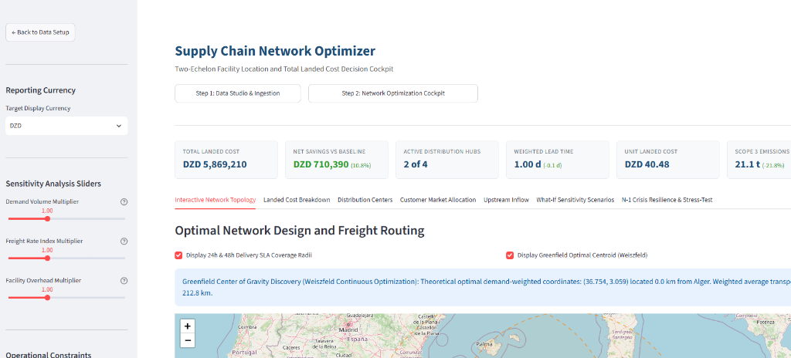
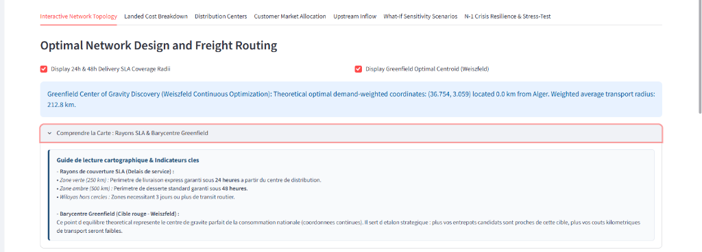
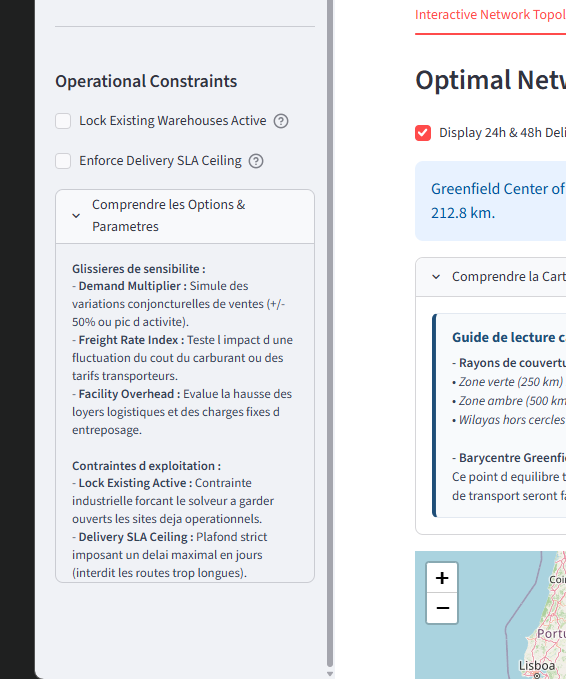

# RouteZone: Supply Chain Network Optimizer (SCNO)

Strategic two-echelon facility location, total landed cost minimization, and supply chain network resilience platform powered by Google OR-Tools and Streamlit.

[](https://www.python.org/)
[](https://developers.google.com/optimization)
[](https://streamlit.io/)
[](tests/)
[](CONTRIBUTING.md)
[](LICENSE)

---

## 1. Executive Summary

RouteZone is a strategic decision-support platform designed to solve the two-echelon Capacitated Facility Location Problem (CFLP) with deterministic mixed-integer linear programming (MILP).

While tactical dispatch tools optimize vehicle routes on a daily basis (Vehicle Routing Problem), RouteZone addresses the multi-million dollar capital expenditure decisions that dictate enterprise supply chain performance over multi-year horizons:
- **Facility Portfolio Selection**: Determines the optimal subset of candidate distribution centers to lease or activate versus mothball.
- **Upstream Inbound Drayage**: Establishes replenishment flows connecting gateway ports and manufacturing hubs to regional distribution centers.
- **Downstream Allocation**: Allocates regional customer markets to open warehouses under strict single-sourcing constraints.
- **Total Landed Cost Minimization**: Balances fixed warehouse overhead, handling fees, inbound transport, and outbound distribution tariffs.
- **Risk and Resilience Quantification**: Stress-tests operational continuity against catastrophic single-node outages (N-1 failure simulation).

```
                      TWO-ECHELON SUPPLY CHAIN TOPOLOGY

 [ Supply Gateways ]             [ Distribution Centers ]            [ Demand Markets ]
  (Ports / Plants)                 (Candidate Warehouses)           (Regional Customers)

   +-------------+                  +------------------+              +---------------+
   | Port Algiers| === Inbound ===> | DC Algiers (F1)  | === Outbound | Algiers City  |
   +-------------+     Freight      +------------------+    Freight   +---------------+
                                      \              /
   +-------------+                     \            /                 +---------------+
   | Port Bejaia | ===================> \          / ===============> | Setif Market  |
   +-------------+                       \        /                   +---------------+
                                          \      /
                                    +------------------+              +---------------+
                                    | DC Constantine   | ===========> | Constantine   |
                                    +------------------+              +---------------+
```

---

## 2. Platform Architecture & Visual Showcase

RouteZone is organized around a two-step enterprise workflow:

### Step 1: Data Studio and Ingestion
Initializes blank configuration matrices, provides immediate auto-fill for standardized benchmark networks (e.g., Algeria national distribution), supports custom CSV uploads, and validates capacity feasibility before solver execution.



```
                            WORKFLOW PIPELINE

  [ Step 1: Ingestion ] ──> [ Step 2: Audit ] ──> [ Step 3: MILP ] ──> [ Step 4: Cockpit ]
   (Auto-fill or CSV)     (Supply vs Demand)     (Google OR-Tools)    (KPIs, Map, Risk)
```


---

### Step 2: Executive Decision Cockpit
Renders an interactive geospatial network map using OpenStreetMap cartography, executive KPI metric cards, detailed cost breakdown charts, facility utilization analytics, sensitivity analysis models, and disruption simulations.



---

## 3. Core Enterprise Capabilities

### 1. Mixed-Integer Linear Program (MILP)
Solves the two-echelon CFLP formulation via Google OR-Tools. Enforces single-sourcing, warehouse throughput capacities, port output quotas, flow conservation, and optional delivery service level agreement (SLA) transit day ceilings.

### 2. Geodesic Transport and Road Circuity Engine
Computes geodesic distances between all supply nodes, candidate warehouses, and customer regions using the Haversine formula. Automatically applies a 1.25 road circuity factor to account for commercial highway geography, converting distances into transit day estimates based on professional driving limits (8 hours/day at 60 km/h).

### 3. Dual-Band SLA Delivery Coverage Radii
Renders visual service coverage zones around each active distribution hub:
- **Green Translucent Zone (250 km)**: Guaranteed 24-hour delivery perimeter.
- **Amber Translucent Zone (500 km)**: Standard 48-hour delivery perimeter.
- **Uncovered Pockets**: Identifies remote customer markets requiring 3 or more transit days.



### 4. Greenfield Continuous Center of Gravity (Weiszfeld Algorithm)
Calculates the theoretical demand-weighted geographic centroid using the Weiszfeld continuous optimization algorithm. Displays the target balance point as a red target marker on the interactive map, providing a baseline to evaluate the spatial quality of candidate warehouse leases.

### 5. Scope 3 Carbon Footprint Accounting
Quantifies greenhouse gas (GHG) freight emissions in metric tonnes of CO2 using the ADEME and European Environment Agency heavy truck standard (0.070 kg CO2 per ton-kilometer). Evaluates environmental impact relative to a single-warehouse status quo baseline.

### 6. Working Capital & Safety Stock Centralization
Applies the Eppen-Maister Square Root Law of Inventory:

$$\text{Safety Stock}(N) = \text{Safety Stock}(1) \times \sqrt{N}$$

Demonstrates the trade-off between inventory holding capital (at an 18% annual carrying rate) and decentralized transportation savings when expanding from 1 to N facilities.

### 7. N-1 Supply Chain Crisis & Disruption Contingency Simulator
Stress-tests the network by disabling an active gateway port or distribution center. Re-solves the degraded contingency network in real time to compute:
- **Network Resilience Score (0 to 100)**: Quantitative measure of absorption capacity.
- **Financial Cost Surge**: Budgetary increase resulting from emergency detour miles.
- **Lead Time Delta**: Customer delivery delay impact.
- **Single Point of Failure (SPOF) Detection**: Identifies bottlenecks where surviving capacity cannot satisfy aggregate demand, outputting executive mitigation steps.

### 8. Multi-Currency Normalization
Solves the linear optimization program in base Algerian Dinar (DZD) to guarantee mathematical linearity, converting outputs into USD or EUR using configurable foreign exchange conversion rates.



---

## 4. Mathematical Formulation

The optimization engine minimizes total landed distribution cost:

### Decision Variables
- $y_i \in \{0, 1\}$: Binary decision variable indicating whether candidate distribution center $i$ is activated.
- $x_{i, j} \in \{0, 1\}$: Binary variable indicating whether customer market $j$ is allocated to facility $i$.
- $flow\_in_{s, i} \ge 0$: Continuous volume shipped from supply gateway $s$ to distribution center $i$.

### Objective Function
$$\min \sum_{i \in F} f_i \cdot y_i + \sum_{i \in F} \sum_{j \in R} v_i \cdot d_j \cdot x_{i, j} + \sum_{s \in S} \sum_{i \in F} c^{in}_{s, i} \cdot flow\_in_{s, i} + \sum_{i \in F} \sum_{j \in R} c^{out}_{i, j} \cdot d_j \cdot x_{i, j}$$

Where:
- $f_i$: Monthly fixed lease and operational overhead of facility $i$.
- $v_i$: Variable handling cost per unit at facility $i$.
- $d_j$: Monthly demand of customer region $j$.
- $c^{in}_{s, i}$: Inbound freight cost per unit from gateway $s$ to facility $i$.
- $c^{out}_{i, j}$: Outbound freight cost per unit from facility $i$ to region $j$.

### Mathematical Constraints
1. **Single-Sourcing**: Every customer market is served by exactly one distribution center:
   $$\sum_{i \in F} x_{i, j} = 1 \quad \forall j \in R$$

2. **Facility Capacity Ceiling**: Demand allocated to an active facility cannot exceed its throughput limit:
   $$\sum_{j \in R} d_j \cdot x_{i, j} \le C^{fac}_i \cdot y_i \quad \forall i \in F$$

3. **Allocation-Activation Linking**: Customer assignment requires prior facility activation:
   $$x_{i, j} \le y_i \quad \forall i \in F, \; j \in R$$

4. **Flow Conservation**: Inbound replenishment volume equals outbound regional shipments:
   $$\sum_{s \in S} flow\_in_{s, i} = \sum_{j \in R} d_j \cdot x_{i, j} \quad \forall i \in F$$

5. **Supply Gateway Capacity**: Total shipments from a gateway cannot exceed its physical capacity:
   $$\sum_{i \in F} flow\_in_{s, i} \le C^{sup}_s \quad \forall s \in S$$

6. **Delivery SLA Threshold (Optional)**: Maximum allowable transit days cannot exceed contract limit $L^{max}$:
   $$lead\_time_{i, j} \cdot x_{i, j} \le L^{max} \quad \forall i \in F, \; j \in R$$

---

## 5. Repository Structure

```
RouteZone/
├── app.py                     # Streamlit enterprise decision cockpit
├── config.py                  # Operational defaults, speeds, circuity, FX rates
├── requirements.txt           # Pinned production dependencies
├── CONTRIBUTING.md            # Open source contribution and engineering standards
├── data/
│   ├── example_algeria.csv    # Benchmark demand dataset (12 Algerian wilayas)
│   ├── suppliers_example.csv  # Gateway ports (Port of Algiers, Port of Bejaia)
│   ├── facilities_example.csv # Candidate DC options (Algiers, Oran, Constantine, Annaba)
│   └── README.md              # Data dictionary and schema specifications
├── docs/
│   └── img/                   # Visual artifacts and platform screenshots
├── src/
│   ├── __init__.py
│   ├── geo_engine.py          # Geodesic Haversine calculations and transit day model
│   ├── data_loader.py         # Pydantic schema validation and matrix synthesis
│   ├── optimizer.py           # Google OR-Tools two-echelon MILP solver
│   ├── network_analyzer.py    # Multi-currency engine and baseline status quo auditor
│   ├── carbon_engine.py       # Scope 3 GHG freight emissions accounting
│   ├── inventory_engine.py    # Eppen-Maister Square Root Law and working capital engine
│   ├── greenfield_engine.py   # Weiszfeld continuous center-of-gravity algorithm
│   ├── resilience_engine.py   # N-1 disruption simulation and SPOF diagnostic engine
│   ├── visualization.py       # Folium cartographic maps and Plotly analytics
│   └── report_generator.py    # 5-tab corporate Excel audit workbook generator
└── tests/
    ├── test_carbon_engine.py
    ├── test_data_loader.py
    ├── test_geo_engine.py
    ├── test_greenfield_engine.py
    ├── test_inventory_engine.py
    ├── test_network_analyzer.py
    ├── test_optimizer.py
    ├── test_report_generator.py
    └── test_resilience_engine.py
```

---

## 6. Installation & Execution

### System Requirements
- Python 3.10 or higher (Tested and certified on Python 3.12 and 3.14).
- Operating System: Linux, macOS, or Windows.

### Setup Instructions

1. **Clone the repository**:
   ```bash
   git clone https://github.com/sambovix/routezone.git
   cd routezone
   ```

2. **Create and activate a virtual environment**:
   ```bash
   # Windows (PowerShell)
   python -m venv .venv
   .\.venv\Scripts\Activate.ps1

   # Linux / macOS
   python3 -m venv .venv
   source .venv/bin/activate
   ```

3. **Install dependencies**:
   ```bash
   pip install --upgrade pip
   pip install -r requirements.txt
   ```

4. **Launch the application**:
   ```bash
   streamlit run app.py
   ```
   Access the dashboard at `http://localhost:8501` (or the port displayed in your terminal).

---

## 7. Verification and Testing

Execute the automated test suite covering all mathematical formulations, data loaders, and analytical engines:

```bash
pytest tests/ -v
```

Expected output:
```text
============================= test session starts =============================
collected 25 items

tests/test_carbon_engine.py::test_calculate_transport_emissions PASSED   [  4%]
tests/test_carbon_engine.py::test_calculate_transport_emissions_invalid_inputs PASSED [  8%]
tests/test_data_loader.py::test_load_regions_valid PASSED                [ 12%]
tests/test_data_loader.py::test_load_regions_missing_column PASSED       [ 16%]
tests/test_data_loader.py::test_load_regions_invalid_latitude PASSED     [ 20%]
tests/test_data_loader.py::test_synthesize_matrices PASSED               [ 24%]
tests/test_geo_engine.py::test_haversine_distance_known_coordinates PASSED [ 28%]
tests/test_geo_engine.py::test_haversine_same_point_is_zero PASSED       [ 32%]
tests/test_geo_engine.py::test_road_distance_applies_circuity PASSED     [ 36%]
tests/test_geo_engine.py::test_estimate_lead_time_days PASSED            [ 40%]
tests/test_geo_engine.py::test_estimate_lead_time_invalid_capacity PASSED [ 44%]
tests/test_greenfield_engine.py::test_weiszfeld_symmetric_points PASSED  [ 48%]
tests/test_greenfield_engine.py::test_weiszfeld_algeria_data PASSED      [ 52%]
tests/test_greenfield_engine.py::test_weiszfeld_empty_raises PASSED      [ 56%]
tests/test_inventory_engine.py::test_square_root_law_scaling PASSED      [ 60%]
tests/test_inventory_engine.py::test_zero_facilities PASSED              [ 64%]
tests/test_network_analyzer.py::test_convert_costs_to_usd PASSED         [ 68%]
tests/test_network_analyzer.py::test_compare_with_baseline PASSED        [ 72%]
tests/test_optimizer.py::test_optimizer_solves_optimally PASSED          [ 76%]
tests/test_optimizer.py::test_optimizer_respects_max_lead_time PASSED    [ 80%]
tests/test_optimizer.py::test_optimizer_detects_infeasible_capacity PASSED [ 84%]
tests/test_report_generator.py::test_generate_excel_report PASSED        [ 88%]
tests/test_resilience_engine.py::test_simulate_supplier_disruption PASSED [ 92%]
tests/test_resilience_engine.py::test_simulate_facility_disruption PASSED [ 96%]
tests/test_resilience_engine.py::test_invalid_node_raises PASSED         [100%]

======================= 25 passed in 0.85s ========================
```

---

## 8. Author Profile

**Mohamed AYATI**
- Master Student in Supply Chain Management with a strong focus on software engineering, IT architectures, Artificial Intelligence, digitalization, and operations research problem solving.
- Personal Website: [devaultos.me](https://devaultos.me)
- GitHub Profile: [@sambovix](https://github.com/sambovix)
- Repository: [sambovix/routezone](https://github.com/sambovix/routezone)

---

## 9. Collaboration & Contributing

Contributions from the open-source community, operations researchers, and supply chain practitioners are encouraged. Please consult [CONTRIBUTING.md](CONTRIBUTING.md) for detailed guidelines on coding hygiene, Google-style docstrings, type annotations, and pull request procedures.

---

## 10. License

This project is licensed under the MIT License. See the [LICENSE](LICENSE) file for details.
